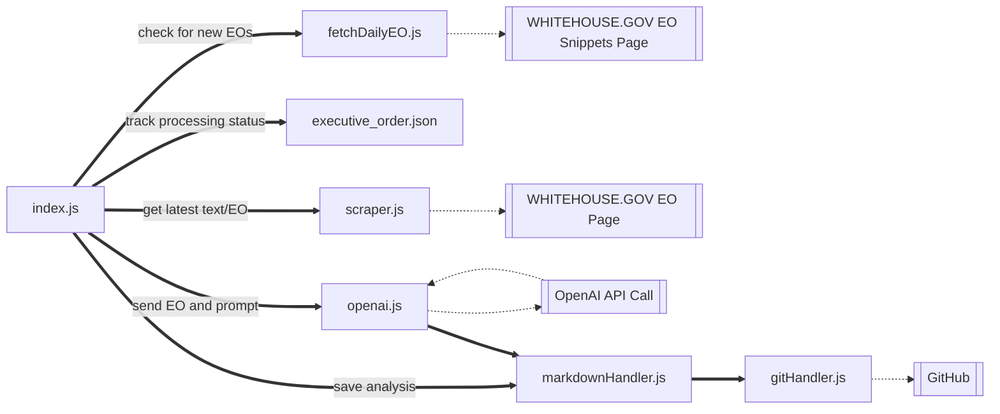

# Resistance Reno AI

Resistance Reno AI is a legal and policy analysis tool that leverages OpenAI's GPT-4.5 model to analyze U.S. executive orders. The tool provides structured evaluations based on progressive values, focusing on free access to healthcare, education, affordable childcare, and housing.

## Table of Contents

- [Installation](#installation)
- [Usage](#usage)
- [Project Structure](#project-structure)
- [Contributing](#contributions)
- [License](#license)

## Current Features
### Implemented Features
- ✅ Automatically scrapes newly published executive orders from the White House website
- ✅ Analyzes orders using GPT-4.5 for constitutionality, truthfulness, and potential harm
- ✅ Saves each analysis as a well-formatted Markdown file
- ✅ Automatically commits and pushes to a GitHub repo
- ✅ Tracks processed orders to avoid duplication
- ✅ JSON-based tracking system for durability and querying
- ✅ "processed": true tracking to ID processed EOs

## 🧭 Roadmap
### 🔨 Core Workflow Enhancements
| Feature	                           | Feature Goal                                                          |
| ---                                  | ---                                                                   |
| "failed": true flag                  | Retry errors manually or via a retry job                              |
|  Markdown archive by year/month	   | Keeps GitHub repo organized as it grows                               |
|  CLI query tool                      |(e.g., --date, --unprocessed) Easily run queries or rerun a day        |
|  Auto-folder Markdown by year        | (2025/2025-04-06_title.md) Better organization in GitHub & local repo |
|  Log file (logs/)	                   | Track what ran and when — helpful for debugging automation            |

### 🔁 Automation Enhancements
| Feature                              | Feature Goal                                   |
| ----                                 | ----                                           |
| Daily schedule via cron	           | Automatically run node index.js every evening  |
| Email or Slack notifications         | Know when new EOs drop (or if something fails) |

### 💬 Community Sharing / Frontend Features
| Feature	                           | Feature Goal                                   |
| ---                                  | ---                                            |
| Community bot integration (discord)  | Posts EO summaries in a Discord thread         |
| Static site or blog (w/Hugo or 11ty) | Auto-generate pages/posts from Markdown files  |
| Dashboard (w/ D3 or Chart.js)        | Visual summaries: scores, trends, etc.         |
| Search + filter UI (tags via Hugo)   | Find EOs by score, keywords, date, or verdict  |

## Installation

1. Clone the repository:
    ```
    git clone https://github.com/brienjl/resistance-reno-ai.git
    cd resistance-reno-ai
    ```

2. Install dependencies:
    ```
    npm install
    ```

3. Create a `.env` file in the root directory and add your OpenAI API key:
    ```
    OPENAI_API_KEY=your_openai_api_key
    ```

## Usage

To start the analysis, run the following command with the URL of the executive order you want to analyze:

```
node index.js
```

The script will:

1. Scrape the White House Executive Orders page for any EOs published today
2. Append them to a cumulative executive_orders.json file
3. Analyze each unprocessed EO via OpenAI
4. Save the result as a Markdown file in executive_order_analysis/
5. Commit and push the file to your GitHub repo

To run a one-off analysis manually (for an EO that’s not from today):

```bash
processExecutiveOrder('directURL');
```

## Project Structure

```
resistance-reno-ai/
├── index.js                  # Main entry point and orchestrator
├── executive_order_analysis/ # Main output folder (markdown analysis drops here)
├── models/
│   ├── openai.js                    # OpenAI API interactions
│   ├── fetchDailyExecutiveOrders.js # Scrapes EO titles + URLs from the main WH page
│   ├── scraper.js                   # Fetches full EO text from individual EO pages
├── utils/
│   ├── gitHandler.js                # Commits + pushes files to GitHub
│   ├── markdownHandler.js           # Formats and saves Markdown files to main output folder
├── .env                      # Store your API keys here
├── .gitignore                # ignore env variables, node_modules, and server log files
├── executive_orders.json     # Tracks all EOs and their processed status

```

## Project Architecture

### Project Diagram



## Contributions
Contributions are welcome! Please open an issue or submit a pull request for any improvements or bug fixes.

## License
This project is licensed under the MIT License. See the LICENSE file for details.